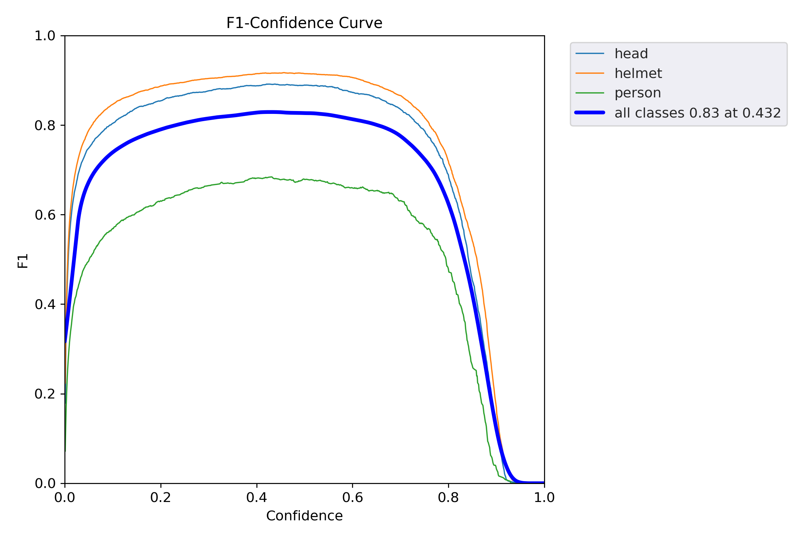
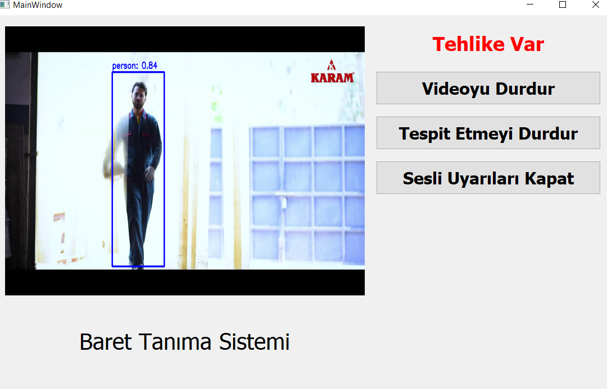

# Safety Helmet Detector
This is an **image processing project** 
implemented to draw attention to the necessary occupational health and safety measures. The project can detect whether a safety helmet is being worn in a video, photo, or real-time camera streams. Detection begins when the 'Tespit etmeye başla' button is clicked. The system issues a 'Tehlike var' warning the moment it detects that a safety helmet is not being worn.


## Project Directory
```
Safety_Helmet_Detector/
 |
 |____SoourceFiles/
 |    |---comu.py
 |    |---detector.py
 |    |---main.py
 |    |---projectUI.py
 |    |---srcScript.py
 |    |---yolov5s.pt
 |    |---sesuyari.mp3
 |    |---best.pt
 |
 |____venv/  
 |____Readme.md
 |____requirements.txt
 
```

## Project Details
In this project, the dataset contains three distinct objects **"head"** **"helmet"** and **"person"**. The dataset was created by combining a public dataset from [Kaggle](https://www.kaggle.com/datasets/andrewmvd/hard-hat-detection) with our own custom dataset. The format of the Kaggle dataset was standardized to match the format structure of our custom dataset.

The resulting images were split into train, validation, and test sets using **Roboflow**. The training configuration was created using YOLOv5. Training was performed by connecting to Roboflow via **Colab**, which generated a weight file and an 'exp' folder containing the training outputs.

Following this process, a user interface was developed using **PyQt5**.




## Technologies Used
* Python
* YOLOv5
* PyQt5 

## Project Run

To run the project on your computer, you must have the ```best.pt``` weight file. **Python version 3.10.11** was used for the project.

You must add audio and video files to the project

* Clone this repository to your local machine.
```
git clone https://github.com/oznurkan/Safety_Helmet_Detectorr.git
```

* Create a virtual environment (venv) in your project directory.

To be able to create a Python virtual environment, you should check the 'Add python.exe to PATH' option during Python installation, or manually add the Python executable to your system's PATH environment variables.
```
py -3.10 -m venv venv
```

* Activate the virtual environment in your project directory.

```
.\venv\Scripts\activate
```

* Install the project dependencies

```
pip install -r requirements.txt
```

* Install torch torchvision torchaudio
  - This download was performed to leverage NVIDIA GPU (CUDA 12.1) acceleration during the YOLOv5 model's detection phase.
    ```
    pip install torch torchvision torchaudio --index-url https://download.pytorch.org/whl/cu121
    ```
  - Alternatively, install the CPU-only version:
    ```
    pip install torch torchvision torchaudio
    ```


* Run your project
```
python SourceFiles/main.py
```

## Project 



